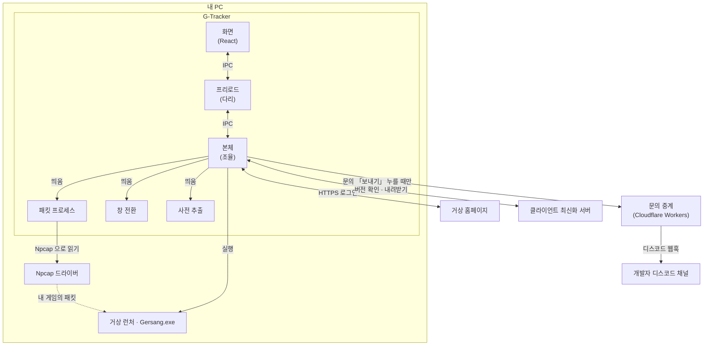
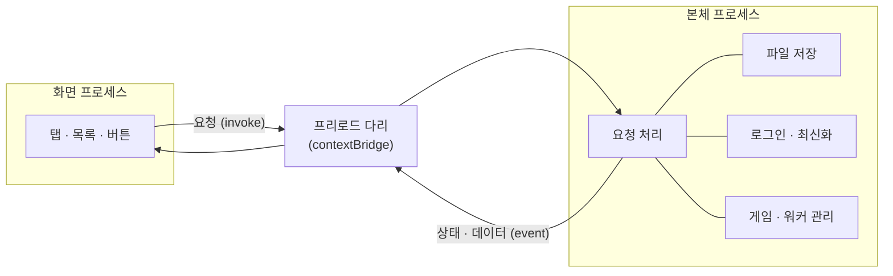
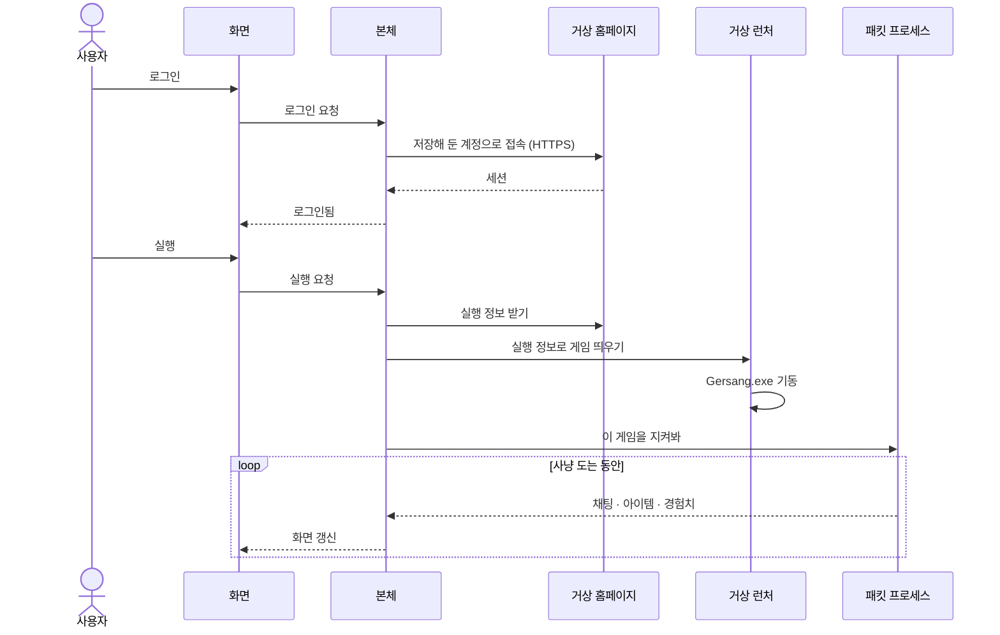
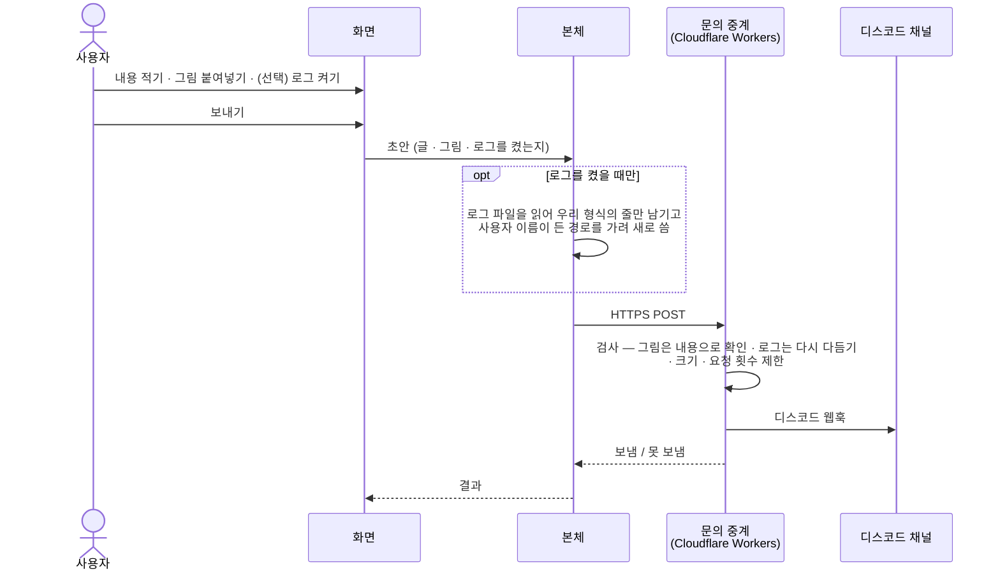

# G-Tracker 구조

> 이 도구가 어떻게 만들어졌는지, 왜 "내 PC 밖으로 안 나간다"가 약속이 아니라 구조인지
> 정리한 글입니다. 사용법은 [README](README.md) 를 보세요.

바깥에 서버를 두지 않은 데스크톱 앱 하나입니다. 로그인부터 게임 실행, 트래킹까지 전부 이
PC 안의 프로세스들이 나눠 맡습니다. 앱이 바깥과 말을 섞는 곳은 **셋** — 로그인할 때의
거상 홈페이지, 클라이언트를 최신으로 맞추는 서버, 그리고 **문의 탭에서 「보내기」를 눌렀을 때만**
쓰는 문의 중계입니다. 통계는 없고, 로그는 문의에서 사용자가 직접 켰을 때만 함께 갑니다.

---

## 한눈에 보기

화면·본체·보조 셋으로 프로세스가 갈립니다. 무거운 일을 화면과 같은 프로세스에 두지 않으려는
것이라, 캡처가 밀려도 화면이 끊기지 않고 그 반대도 마찬가지입니다.

| 프로세스 | 하는 일 |
|---|---|
| **본체** | 로그인·게임 실행·파일 저장을 조율합니다. 나머지 프로세스를 띄우고 잇는 곳입니다 |
| **화면** | 탭과 목록을 그립니다. 데이터를 직접 만지지 않고 본체에 물어봅니다 |
| **패킷** | 내가 띄운 게임이 주고받는 것을 읽어 채팅·아이템·경험치로 풀어 냅니다. 본체와 떨어져 돌아, 사냥이 바빠도 화면이 버팁니다 |
| **창 전환** | 단축키로 게임 창을 앞으로 가져옵니다 |
| **사전 추출** | 아이템 이름·그림을 클라이언트에서 한 번 뽑아 둡니다 |

---

## 화면과 본체는 어떻게 말하나

화면 쪽 코드는 파일도, 네트워크도, 게임 프로세스도 **직접 만질 수 없습니다.** 할 수 있는
것은 정해진 통로 하나로 본체에 부탁하는 것뿐이고, 그 통로가 프리로드(다리)입니다.

- **화면 → 본체**: "이 계정으로 로그인해", "이 슬롯 실행해" 같은 요청을 보냅니다.
- **본체 → 화면**: 로그인 상태, 새로 들어온 채팅·아이템·경험치를 밀어 줍니다.

통로를 하나로 좁혀 둔 덕에, 화면에서 무엇을 누르든 실제로 파일을 쓰거나 게임을 띄우는 일은
전부 본체 한 곳을 거칩니다. 화면은 결과를 그리기만 합니다.

패킷·창 전환·사전 추출 프로세스는 본체가 띄우고, 본체하고만 메시지를 주고받습니다. 화면과
직접 이야기하지 않습니다.

---

## 로그인부터 트래킹까지

로그인은 저장해 둔 계정으로 홈페이지에 붙어 **세션만** 받아 오는 일입니다. 평소에는 창을
띄우지 않습니다 — 직접 확인이 필요한 때(캡차·공지)만 그 계정으로 사이트 창을 엽니다.

실행은 홈페이지에서 받은 실행 정보를 거상 런처에 그대로 넘겨 게임을 띄웁니다. 그런 다음
패킷 프로세스에 "이 게임을 지켜봐" 라고 넘기면, 그때부터 오가는 것을 읽어 화면에 채웁니다.
**앱을 켜기 전에 지나간 것은 볼 수 없습니다.**

---

## 문의는 어떻게 가나

문의 탭에서 「보내기」를 누르면 본체가 **우리 문의 중계**로 보내고, 중계가 개발자의 디스코드
채널에 올립니다. 누르기 전에는 아무것도 나가지 않습니다.

- **왜 중계를 거치나.** 디스코드 웹훅 주소를 앱에 넣으면 누구나 앱에서 꺼내 그 채널에 글을
  쏘거나 웹훅을 지워 버릴 수 있습니다. 웹훅 주소는 중계(Cloudflare Workers)에만 비밀값으로
  두고, 앱은 중계 주소만 압니다. 중계는 멘션·사칭을 막고, 요청 횟수와 크기를 자릅니다.
- **함께 가는 것.** 적은 내용, 연락처(적었을 때만), 붙여넣은 그림, 환경 네 줄(앱 버전 · OS ·
  창 크기 · 캡처 상태) — 환경은 보내기 전에 화면에 그대로 보여 줍니다.
- **로그는 켰을 때만.** 「로그 파일 함께 보내기」는 늘 꺼진 채 시작하고, 보내고 나면 다시 꺼집니다.
  켜면 몇 줄·몇 KB 가 가는지 옆에 적힙니다. 로그 파일을 그대로 보내지 않고 **우리 로그 형식의
  줄만 남겨 새로 쓰며**, 윈도 사용자 이름이 든 경로(`C:\Users\<이름>\…`)는 가립니다. 중계도
  같은 검사를 한 번 더 합니다.
- **사용자가 고를 수 있는 파일은 그림뿐입니다.** 그림도 중계가 내용(파일 앞머리)으로 확인해
  그림이 아니면 뺍니다.
- **안 가는 것.** 계정 비밀번호, 게임 설치 경로, 채팅 · 아이템 · 경험치 기록.

---

## 트래킹은 읽기만 합니다

트래킹은 내가 띄운 거상 클라이언트가 주고받는 것을 **곁에서 읽는** 방식입니다(그래서
Npcap 이 필요합니다). 게임에 무언가를 보내거나, 메모리를 건드리거나, 파일을 고치는 일은
없습니다. 다른 프로그램의 트래픽도 잡지 않습니다 — 내가 띄운 게임의 것만 봅니다.

---

## 무엇과 통신하나

| 상대 | 언제 | 무엇을 |
|---|---|---|
| **거상 홈페이지** | 로그인 · 실행 직전 | 저장한 계정으로 세션을 받고, 실행 정보를 받습니다 |
| **클라이언트 최신화 서버** | 실행 직전 · 클라이언트 받기 | 클라이언트가 최신인지 확인하고, 뒤처졌으면 받아 둡니다 |
| **문의 중계 (Cloudflare Workers)** | 문의 탭에서 「보내기」를 누를 때만 | 문의 내용 · 그림 · 환경 네 줄, 켰을 때만 다듬은 로그. 중계가 디스코드 웹훅으로 개발자 채널에 올립니다 |

이 셋 말고 바깥으로 나가는 요청은 없습니다.

---

## 어디에 무엇이 남나

| 무엇 | 어디에 | 앱을 끄면 |
|---|---|---|
| **비밀번호** | Windows 자격 증명(DPAPI)으로 암호화해 이 PC 에만 | 남습니다 (이 PC 에서만 풀립니다) |
| **계정 · 클라이언트 설정** | 앱 데이터 폴더에 파일로 | 남습니다 |
| **주막 임무 시간 · 이벤트 체크** | 앱 데이터 폴더에 파일로 | 남습니다 (다음에 이어 보려고) |
| **채팅 · 아이템 · 경험치 · 상단 명단과 주간 기여도** | 메모리에만 | 사라집니다 |
| **로그** | 앱 데이터 폴더의 `logs` (배포본은 경고·오류만, 1MB 두 벌) | 남습니다. 사용자 이름이 든 경로는 가려서 씁니다 |
| **보낸 문의** | 개발자 디스코드 채널 | 보낸 뒤로는 그 채널에 남습니다 |

파일로 남는 것도 전부 이 PC 안입니다. 비밀번호 파일은 다른 컴퓨터로 옮겨도 풀리지
않습니다 — 자격 증명이 그 PC 에 묶여 있기 때문입니다.

---

## 무엇으로 만들었나

| | |
|---|---|
| **앱 틀** | Electron (본체는 Node, 화면은 Chromium) |
| **화면** | React + TypeScript |
| **패킷 읽기** | `dumpcap` (앱에 함께 담김) + 사용자가 설치하는 Npcap 드라이버 |
| **문의 중계** | Cloudflare Workers → Discord 웹훅 |
| **대상** | Windows 10 / 11 (64비트) |
