<!--
  배포용 README. 빌드된 실행 파일(설치본)과 함께 내는 안내다.

  **소스 코드는 공개하지 않는다.** 배포하는 것은 `npm run dist` 로 만든 실행 파일뿐이다.
  그래도 이 글에는 프로토콜 분석 결과를 넣지 않는다 — opcode 번호도, 패킷 구조도,
  어떻게 알아냈는지도 적지 않는다. 사용자가 알아야 하는 것은 이 도구가 무엇을 하고
  어떻게 쓰는지뿐이다.

  이미지는 `images/` 에 넣는다. 파일 이름은 아래 표를 따른다.
-->

# G-Tracker

> 거상(Gersang) 다클라 유저를 위한 **로컬 통합 런처 + 실시간 트래킹**

계정과 클라이언트를 한 화면에서 관리하고, 로그인부터 게임 실행까지 이어서 처리합니다.
게임이 도는 동안에는 전체 채팅, 얻은 아이템, 부대원 경험치를 계정별로 모아 보여 주고,
주막 임무·이벤트 과제·상단 현황까지 한자리에서 챙깁니다.

**모든 처리는 내 PC 안에서만 일어납니다.** 서버로 보내는 것이 없습니다.

---

## 먼저 읽어 주세요 — Npcap 이 있어야 합니다

**채팅·수익 트래킹·EXP 를 비롯한 트래킹 기능을 쓰려면
[Npcap](https://npcap.com/#download) 을 설치해야 합니다.**

패킷을 읽는 도구는 **앱에 이미 들어 있어** 따로 설치할 것이 없습니다. 그 아래에서 실제로
패킷을 잡는 드라이버인 **Npcap** 만 있으면 됩니다. (예전에는 Wireshark 를 통째로 깔아야
했지만, 이제 그럴 필요 없습니다.)

**설치** — [npcap.com](https://npcap.com/#download) 에서 Npcap 설치본을 받아 깝니다.
설치 화면의 **`Install Npcap in WinPcap API-compatible Mode`** 는 **반드시 켜 두세요**
(기본값으로 켜져 있습니다). 이게 꺼져 있으면 앱이 패킷을 못 잡습니다. 나머지 옵션은 기본값
그대로면 됩니다.

**이미 Npcap 이 있는 경우** (다른 프로그램에서 깔았거나 Wireshark 와 함께 깔린 경우) —
대개 그대로 쓰면 됩니다 (제어판 → 프로그램에 `Npcap` 이 보이면 됩니다). 다만 트래킹이 안
잡히면 `WinPcap API-compatible Mode` 를 끄고 깔았을 수 있으니, Npcap 설치본을 다시 받아 그
항목을 **켜고** 다시 설치해 주세요.

게임이 이미 켜져 있어도 됩니다. 다만 트래킹은 **앱을 켠 뒤부터** 오가는 것을 보므로, 게임을
먼저 켜 두었다면 상단 명단처럼 **일부 기능이 비어 있거나 제대로 안 뜰 수 있습니다.** 그럴
때는 **게임에서 한 번 재접속(로그아웃 후 다시 로그인)** 하면 처음부터 다시 잡혀 채워집니다.

> **런처만 쓸 거라면 없어도 됩니다.** 로그인·다클라 실행은 Npcap 없이도 그대로 동작합니다.
> 트래킹 탭만 "Npcap 이 설치돼 있는지 확인해주세요." 를 띄우고 비어 있습니다.

---

## 무엇을 해 주나

|                        |                                                                                                                                        |
| ---------------------- | -------------------------------------------------------------------------------------------------------------------------------------- |
| **다클라 한 화면**     | 슬롯 세 개. 계정과 클라이언트를 골라 두면 로그인부터 실행까지 이어서 처리합니다                                                        |
| **다클라 폴더 만들기** | 원본 클라이언트 옆에 복사본을 만들어 줍니다. 용량이 큰 파일은 링크로 걸어 디스크를 아낍니다                                            |
| **자동 로그인 · OTP**  | 저장해 둔 계정으로 로그인합니다. OTP 계정은 인증번호만 입력하면 됩니다                                                                 |
| **홈페이지 바로 열기** | 로그인해 둔 그 계정으로 거상 홈페이지를 엽니다. 계정마다 따로 열려서 이벤트·출석체크에 편합니다                                        |
| **채팅**               | 전체 채팅을 계정별로 모아 봅니다                                                                                                       |
| **수익 트래킹**        | 사냥에서 얻은 아이템을 이름·아이콘과 함께 집계합니다                                                                                   |
| **EXP**                | 부대원 열두 칸의 경험치 증가·시간당 속도·레벨 진행률·장착 장비·전투 시간                                                               |
| **주막 임무**          | 주막에 보낸 용병이 언제 돌아오는지, 어떤 임무가 끝났는지 봅니다. 앱을 껐다 켜도 이어집니다                                             |
| **거상 이벤트**        | 이벤트가 도는 날, 캐릭터마다 그날 과제(퀘스트·추천 장부 등)를 챙겼는지 봅니다                                                          |
| **상단**               | 상단 명단·주간 기여도·연구를, 게임이 안 남겨 주는 것까지 모아 지난주와 견줍니다                                                        |
| **파티 획득 가려내기** | 파티로 사냥하면 같은 아이템이 파티원 전원 클라에 잡히는데, 누가 주웠는지 계산해 **먹은 사람에게만** 셉니다. 켜고 끌 것 없이 자동입니다 |
| **자리 합치기**        | 앱보다 먼저 켜 둔 게임이 따로 잡혔을 때 한 자리에서 모아 봅니다                                                                        |

**하지 않는 것** — 자동 사냥, 매크로, 게임 메모리 수정, 서버로 명령 보내기. 화면에 보여 주는 일만 합니다.

---

## 화면 둘러보기

### ① 클라이언트

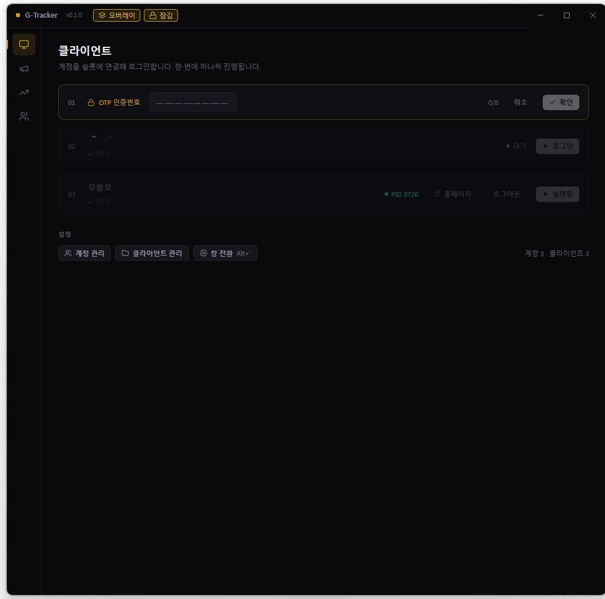

슬롯마다 계정과 클라이언트를 고릅니다. 로그인이 끝나면 **실행** 버튼이 뜨고, 그 옆의
**홈페이지** 버튼은 그 계정으로 거상 사이트를 엽니다(창을 닫아도 로그인은 유지됩니다).

OTP 를 쓰는 계정은 그 줄이 인증번호 입력 칸으로 바뀝니다. 틀리면 칸이 비워지고
5초 뒤에 다시 칠 수 있습니다.

아래 버튼으로 여는 창들:

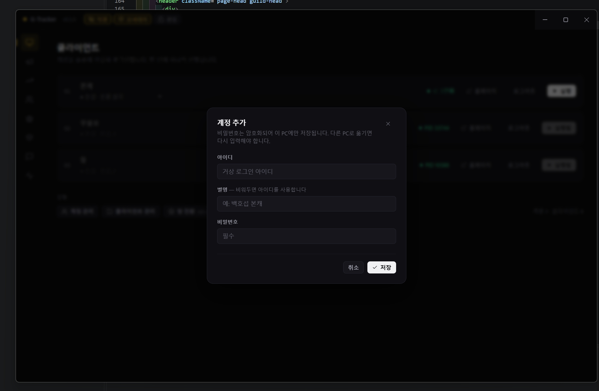

**계정 관리** — 거상 아이디·비밀번호를 등록합니다. 비밀번호는 이 PC 에만 암호화해 둡니다.

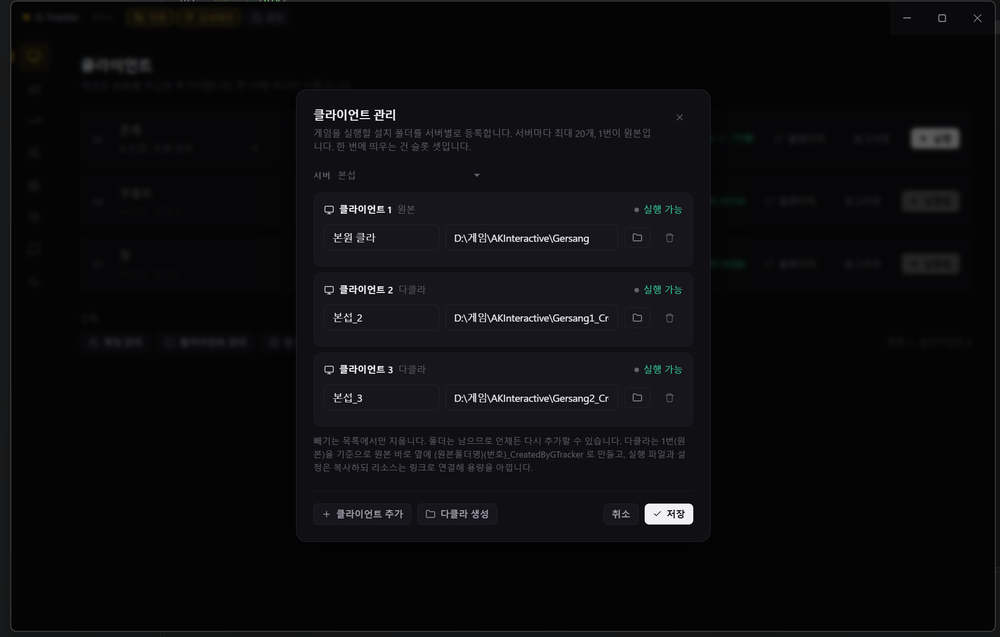

**클라이언트 관리** — 거상을 설치한 폴더를 원본으로 지정하고, 다클라 폴더를 만듭니다.

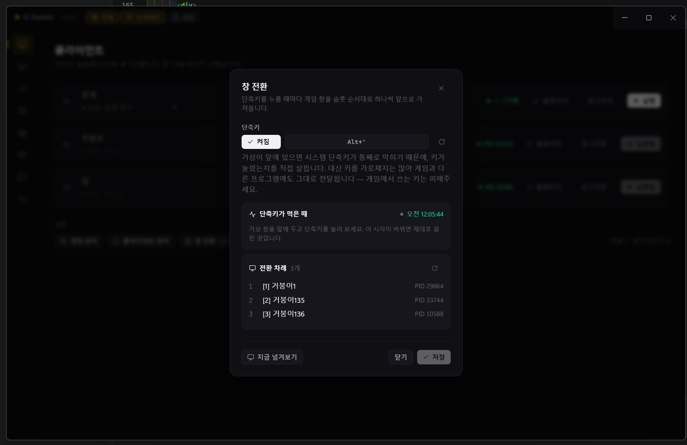

**창 전환** — 단축키로 게임 창을 앞으로 가져오는 설정입니다.

### ② 채팅

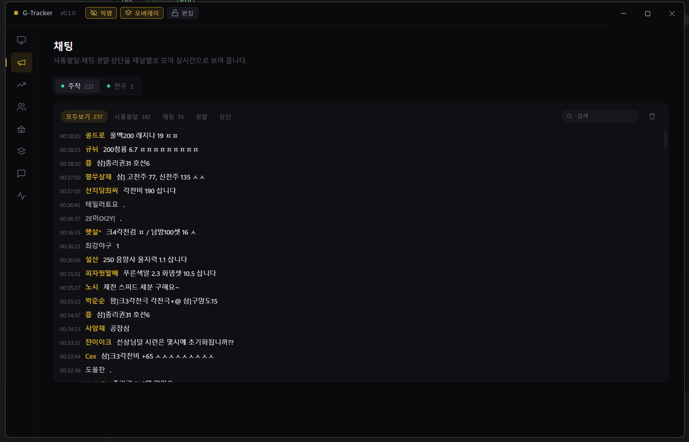

전체 채팅을 계정별로 모아 봅니다. 내가 보낸 줄은 밝게 표시됩니다.

### ③ 수익 트래킹

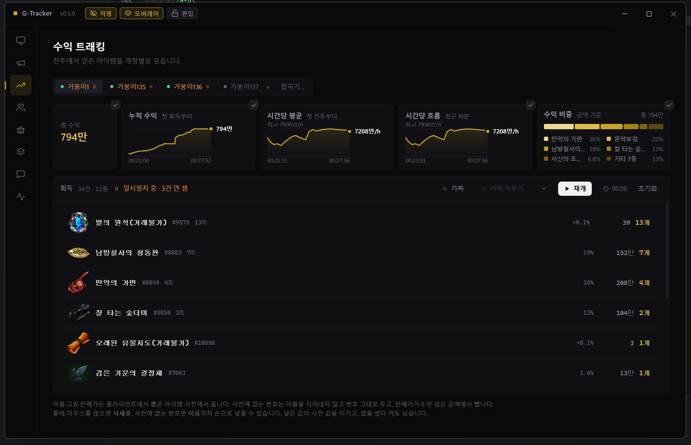

사냥에서 얻은 아이템을 종류별로 셉니다. 이름과 그림은 클라이언트에서 뽑은 사전에서
가져옵니다. 사전에 없는 번호는 이름을 지어내지 않고 번호 그대로 둡니다.

파티원이 먹은 것과, 누구 것인지 가리지 못한 것은 목록에 넣지 않고 **건수만** 따로 보여
줍니다.

앱을 켜기 전부터 게임이 떠 있었다면 그 자리는 아이디 대신 `PID 12345` 로 잡힙니다.
같은 클라가 두 자리로 갈렸을 때는 `합치기` 로 한 자리에서 모아 볼 수 있습니다.
`분리` 를 누르면 각자에게 그대로 돌아갑니다.

`합치기` 를 누르면 뜨는 창:

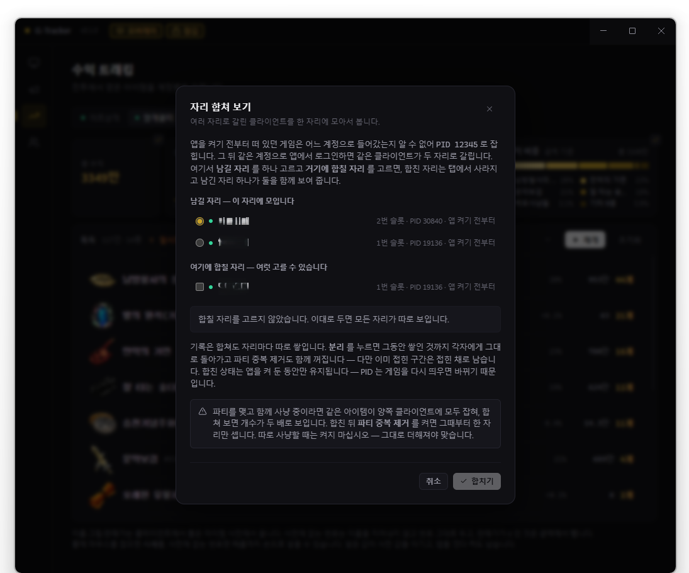

### ④ EXP

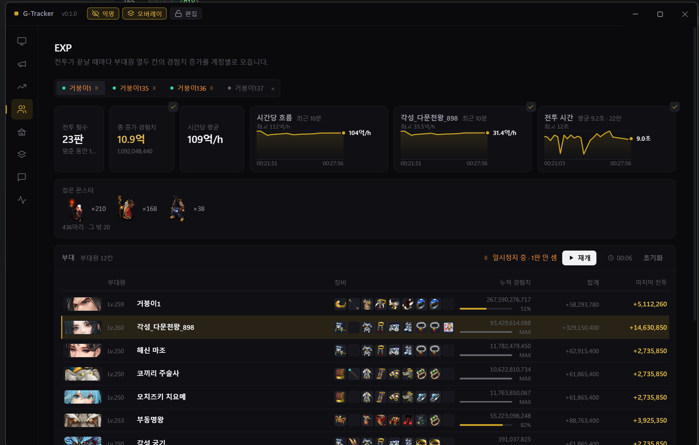

전투가 끝날 때마다 부대원 열두 칸의 경험치를 모읍니다.

- **시간당 경험치** — 최근 10분으로 잰 속도의 흐름
- **전투 시간** — 판마다 얼마나 걸렸는지와 평균
- **부대원 줄** — 레벨·이름·장착 장비 아홉 칸·누적 경험치와 **레벨 진행률 막대**
- 상한에 닿은 부대원은 `MAX` 로 표시합니다

### ⑤ 주막 임무

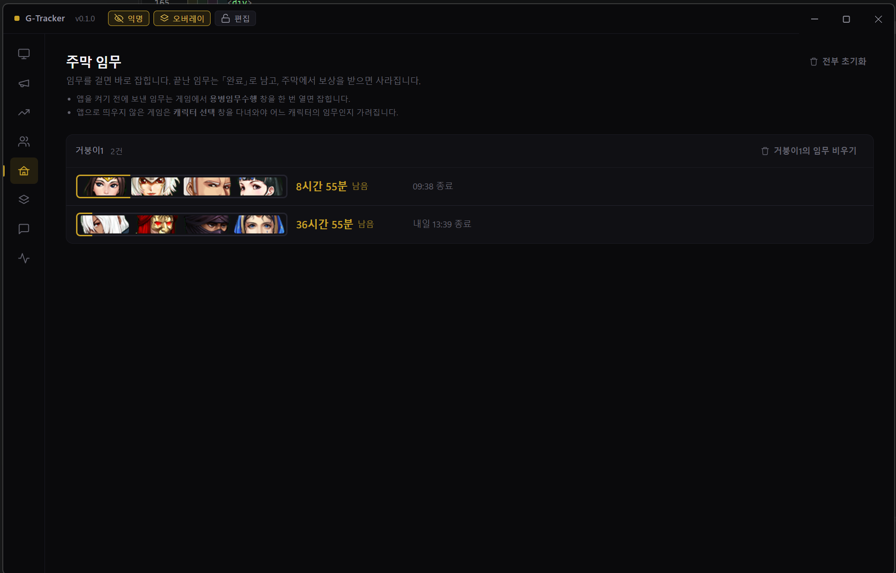

주막에 보낸 용병 임무의 남은 시간을 봅니다. 8시간에서 60시간짜리라 앱을 껐다 켜도
이어집니다. 임무를 걸고 게임의 `용병임무수행` 창을 한 번 열면 잡히고, 끝난 임무는
`완료` 로 남습니다.

주막에서 **보상을 받으면 목록에서 사라집니다.** 그래서 `완료` 로 남아 있는 줄은 "아직
보상을 안 받았다" 는 뜻입니다 — 어느 캐릭터가 받을 게 있는지 여기서 한눈에 봅니다.

### ⑥ 거상 이벤트

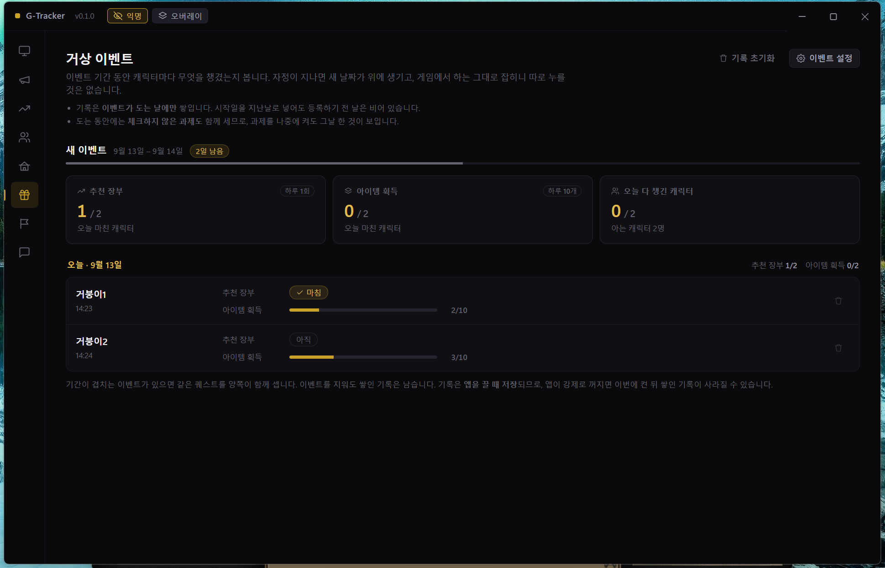

이벤트가 도는 날, **캐릭터마다 그날 과제를 챙겼는지** 봅니다. 날짜별로 묶어 두어 "오늘
아직 안 한 캐릭터" 가 바로 보입니다. 다 챙긴 줄은 `마침` 으로 표시됩니다.

체크하지 않은 과제도 앱을 끌 때 저장되니, 며칠에 걸친 이벤트도 이어서 챙길 수 있습니다.
이벤트가 없는 날에는 세지 않습니다.

이벤트 기간과 그날 챙길 과제(퀘스트·추천 장부·정령 탐색·정령 포획)는 설정 창에서 고릅니다:

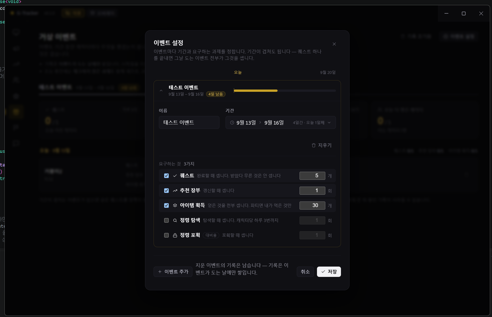

### ⑦ 상단

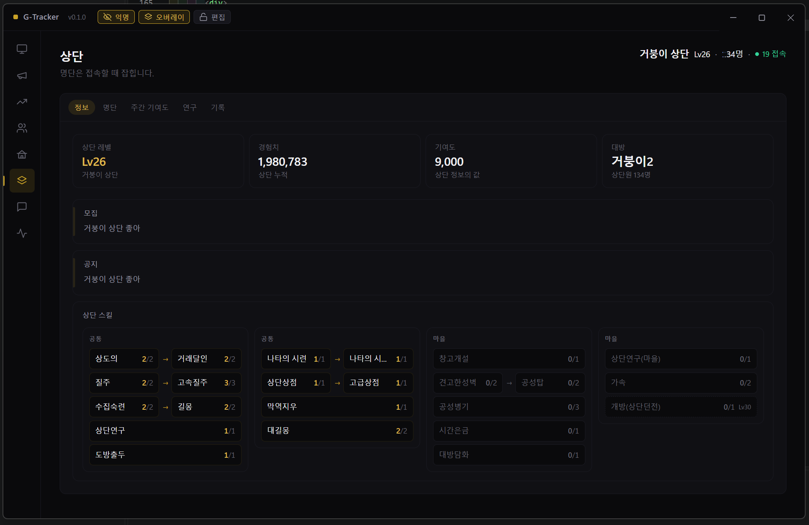

상단(길드) 정보를 게임이 안 남겨 주는 것까지 남겨 봅니다. 명단·주간 기여도·연구·기록으로
나뉩니다.

> **명단은 로그인할 때 한 번 들어옵니다.** 그래서 앱을 게임보다 늦게 켜면 명단이 비어
> 있을 수 있습니다. 그럴 때는 게임에서 상단 창을 다시 여는 대신, 앱을 켜 둔 채로 로그인을
> 한 번 더 하면 채워집니다.

### ⑧ 오버레이

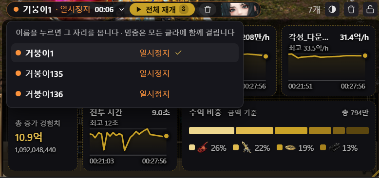

게임 위에 반투명하게 얹는 작은 창입니다. 사냥하는 동안 앱으로 창을 바꾸지 않고도 수익·경험치
같은 값을 바로 봅니다. 투명도와 크기를 조절할 수 있고, 보고 싶은 것만 골라 띄웁니다.

---

## 설치

### 필요한 것

|                                          |                                                                                                                                        |
| ---------------------------------------- | -------------------------------------------------------------------------------------------------------------------------------------- |
| **Windows 10 / 11**                      | 64비트                                                                                                                                 |
| **거상 클라이언트**                      | 이미 설치되어 있어야 합니다                                                                                                            |
| **[Npcap](https://npcap.com/#download)** | 트래킹(채팅·수익·EXP·주막·이벤트·상단)에 **필수**. 패킷 읽는 도구는 앱에 들어 있고, Npcap 드라이버만 설치하면 됩니다 (맨 위 항목 참조) |
| **관리자 권한**                          | 실행할 때 UAC 창이 한 번 뜹니다                                                                                                        |

> Npcap 이 없어도 런처(로그인·실행)는 그대로 동작합니다. 트래킹 탭만 사유를 띄우고 비어 있습니다.

**관리자 권한이 필요한 이유는 셋입니다** — 게임 실행 파일이 관리자 권한을 요구하고,
다클라 폴더를 만들 때 링크를 걸어야 하며, 패킷을 읽으려면 그 권한이 있어야 합니다.

### 받기

[**Releases**](../../releases) 에서 `G-Tracker Setup x.y.z.exe` 를 받아 설치합니다.
설치 경로는 원하는 곳으로 바꿀 수 있습니다.

---

## 처음 실행하기

1. **계정 등록** — 클라이언트 탭 아래 `계정 관리` 에서 거상 아이디와 비밀번호를 넣습니다.
   비밀번호는 Windows 자격 증명 방식으로 암호화해 이 PC 에만 저장됩니다.
2. **클라이언트 등록** — `클라이언트 관리` 에서 거상을 설치한 폴더를 **원본**으로 지정합니다.
   다클라가 필요하면 같은 화면의 **다클라 생성** 을 누릅니다. 원본 옆에 다음 번호로 폴더가 만들어집니다.
3. **슬롯 채우기** — 슬롯마다 계정과 클라이언트를 고릅니다.
4. **로그인** — `로그인` 을 누릅니다. OTP 계정이면 인증번호를 칩니다.
5. **실행** — `실행` 을 누르면 게임이 뜹니다. 그때부터 트래킹 탭이 채워집니다.

> 트래킹은 **게임이 실행된 뒤** 오가는 것만 봅니다. 사냥을 시작하고 전투를 한 판 끝내면
> EXP 탭에 값이 뜨고, 경험치 속도는 한 판 더 필요합니다(첫 판은 기준점으로 쓰입니다).

---

## 자주 겪는 일

**트래킹 탭이 비어 있습니다**
Npcap 이 깔려 있는지 확인하세요(제어판 → 프로그램). 깔려 있는데도 안 잡히면 Npcap 을
**`WinPcap API-compatible Mode`** 로 깔았는지 보세요 — 이 항목을 끄고 깔았으면 앱이 패킷을
못 잡습니다(맨 위 설치 안내 참조). 앱을 관리자 권한으로 실행했는지, 게임을 앱보다 먼저 켰다면
게임에서 한 번 **재접속(로그아웃 후 다시 로그인)** 했는지도 함께 봅니다.

---

## 내 정보는 어떻게 다루나

- **밖으로 나가는 것이 없습니다.** 통계 수집도, 원격 서버도 없습니다.
- **비밀번호**는 Windows 자격 증명(DPAPI)으로 암호화해 이 PC 에만 저장됩니다.
  다른 컴퓨터로 파일을 옮겨도 풀리지 않습니다.
- **패킷**은 내가 띄운 거상 클라이언트의 것만 봅니다. 다른 프로그램의 트래픽은 잡지 않습니다.
- **채팅·아이템·경험치**는 앱을 끄면 사라집니다. **주막 임무 시간·이벤트 체크·상단 기록**은
  다음에 이어 보려고 이 PC 에 파일로 저장해 둡니다 — 역시 밖으로 나가지 않습니다.

---

## 어떻게 만들어졌나

바깥에 서버를 두지 않은 **데스크톱 앱 하나**입니다. 로그인부터 실행, 트래킹까지 전부 이
PC 안에서 끝나고, 앱이 바깥과 말을 섞는 곳은 로그인할 때의 거상 홈페이지와 클라이언트를
최신으로 맞추는 서버뿐입니다. 트래킹은 내가 띄운 게임이 주고받는 것을 곁에서 **읽기만**
합니다 — 보내거나 고치는 일은 없습니다.

프로세스 구성, 무엇과 통신하는지, 내 정보가 어디에 남는지는 [**아키텍처 문서**](ARCHITECTURE.md)
에 정리해 두었습니다.

---

## 알려진 한계

- **Windows 전용**입니다.
- 슬롯은 **세 개**까지입니다.
- 게임을 앱보다 먼저 켜면 그 전에 오간 것은 볼 수 없습니다. 게임에서 한 번 재접속(다시 로그인)하면 그때부터 정상으로 잡힙니다 — 재접속 전에는 그 자리가 아이디 대신 `PID 12345` 로 보일 수 있습니다.
- 거상 이벤트는 이벤트가 도는 날에만 셉니다.

---

## 고지

이 도구는 **비공식**이며 게임사와 아무 관련이 없습니다.

패킷을 읽는 것과 다중 클라이언트 실행은 **게임 이용약관에 저촉될 소지가 있습니다.**
본인 계정을 대상으로 한 읽기 전용 관찰이라도 제재 가능성을 확인하고 사용하시기 바랍니다.
사용에 따른 책임은 사용자 본인에게 있습니다.

**게임사에서 배포 중단을 요청하면 즉시 배포를 중단합니다.**

---

## 라이선스

© G-Tracker. All rights reserved.

배포하는 것은 빌드된 실행 파일뿐이며, 소스 코드를 따로 공개하지는 않습니다. 다만 이 앱은
**Electron 으로 만들었습니다.** C++·Go·Rust 처럼 기계어로 컴파일돼 뜯어도 원본을 알아보기
어려운 언어와 달리, Electron 앱은 설치본 안에 **자바스크립트 코드가 거의 그대로 들어
있어** 압축만 풀면 로직이 훤히 드러납니다. 숨길 수도 없고, 숨길 생각도 없습니다 —
**뜯어 보실 분은 얼마든지 보셔도 됩니다.**

별도 허락 없이 **복제·재배포·상업적 이용을 허용하지 않습니다.**
